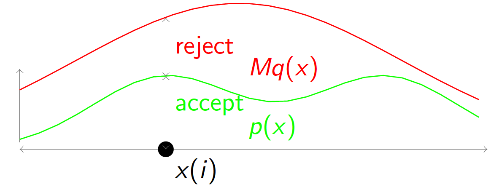

# 蒙特卡洛采样
## 面对的问题
- 计算机只能实现对均匀分布的采样，但我们仍然可以在此基础上对更为复杂的分布进行采样，那具体该如何操作呢？
- 随机分布的某些数字特征可能需要通过积分的形式来求解，但是某些积分可能没有（或者很难求得）解析解，彼时我们该如何处理呢？
- 在贝叶斯推断中，后验概率的分布是正⽐于先验和似然函数之积的，但是先验和似然函数的乘积形式可能相对复杂，我们又该如何对这种形式复杂的分布进行采样呢？

## Inverse CDF方法

## 接受拒绝法

先找到一个比较容易求分布的函数q(x)，乘以系数M，使得能完全罩住p(x)，然后，对q(x)进行采样，并以一定的概率拒绝它，即能得到p(x)的分布。参考分布q(x)通常采用均匀分布。

## MCMC方法
定理：[细致平稳条件] 如果非周期马氏链的转移矩阵P和分布π(x) 满足 π(i)Pij=π(j)Pji for all i,j 则 π(x) 是马氏链的平稳分布，上式被称为细致平稳条件(detailed balance condition)。

这个定理强调了两个内容
1、对于任何两个状态i,j 可以从i转换到j，也可以从j转换到i
2、在两者的转换过程中没有损失
即：p(i)q(i,j)=p(j)q(j,i)

但是一般情况下，我们在马尔科夫链中这两个状态转换间并不相等
p(i)q(i,j)≠p(j)q(j,i)
也就是细致平稳条件不成立，怎么办呢？
那么我们希望对马氏链做一个改造，使得细致平稳条件成立，譬如，我们引入一个 α(i,j), 我们希望两边都乘以这个函数后会相等即：
p(i)q(i,j)α(i,j)=p(j)q(j,i)α(j,i) （1）
显然我们让
α(i,j)=p(j)q(j,i)，α(j,i)=p(i)q(i,j)
原式（1）变为p(i)q(i,j)*p(j)q(j,i)=p(j)q(j,i)*p(i)q(i,j) 显然是可以相等
我们把α(i,j)称为接受率，物理意义可以理解为在原来的马氏链上，从状态 i 以q(i,j) 的概率转跳转到状态j 的时候，我们以α(i,j)的概率接受这个转移。
把以上的过程整理一下，我们就得到了如下的用于采样概率分布p(x)的算法 

以上的 MCMC 采样算法已经能很漂亮的工作了，不过它有一个小的问题，收敛到平稳分布p(x)的速度太慢。有没有办法提升一些接受率呢?
假设 α(i,j)=0.1,α(j,i)=0.2, 此时满足细致平稳条件，于是
p(i)q(i,j)×0.1=p(j)q(j,i)×0.2

上式两边扩大5倍，我们改写为
p(i)q(i,j)×0.5=p(j)q(j,i)×1

看，我们提高了接受率，而细致平稳条件并没有打破！这启发我们可以把细致平稳条件(**) 式中的α(i,j),α(j,i) 同比例放大，使得两数中最大的一个放大到1，这样我们就提高了采样中的跳转接受率。所以我们可以取
α(i,j)=min{p(j)q(j,i)p(i)q(i,j),1}
于是，经过对上述MCMC 采样算法中接受率的微小改造，我们就得到了如下教科书中最常见的 Metropolis-Hastings 算法。 
http://blog.csdn.net/qjzcy/article/details/51745190
## Gibs采样法

