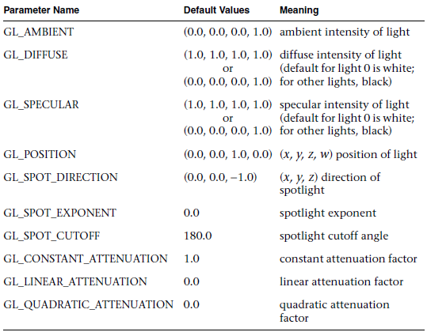
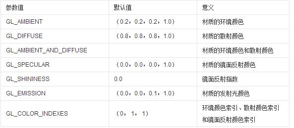

# opengl light
## 设置单个光源
```
//打开光照,一共有0~7，一共八个光源，实际实验这一句好像作用不大
glEnable(GL_LIGHTING);
//使能光照0
glEnable(GL_LIGHT0);
//设置光源0
```
```
GLfloat light1_ambient[] = { 0.2, 0.2, 0.2, 1.0 };
GLfloat light1_diffuse[] = { 1.0, 1.0, 1.0, 1.0 };
GLfloat light1_specular[] = { 1.0, 1.0, 1.0, 1.0 };
GLfloat light1_position[] = { -2.0, 2.0, 1.0, 1.0 };
GLfloat spot_direction[] = { -1.0, -1.0, 0.0 };
glLightfv(GL_LIGHT1, GL_AMBIENT, light1_ambient);
glLightfv(GL_LIGHT1, GL_DIFFUSE, light1_diffuse);
glLightfv(GL_LIGHT1, GL_SPECULAR, light1_specular);
glLightfv(GL_LIGHT1, GL_POSITION, light1_position);
glLightf(GL_LIGHT1, GL_CONSTANT_ATTENUATION, 1.5);
glLightf(GL_LIGHT1, GL_LINEAR_ATTENUATION, 0.5);
glLightf(GL_LIGHT1, GL_QUADRATIC_ATTENUATION, 0.2);
glLightf(GL_LIGHT1, GL_SPOT_CUTOFF, 45.0);
glLightfv(GL_LIGHT1, GL_SPOT_DIRECTION, spot_direction);
glLightf(GL_LIGHT1, GL_SPOT_EXPONENT, 2.0);
glEnable(GL_LIGHT1);

```
光源属性一览表

## 设置全局环境光(光照模式）
OpenGL提供了一种全局的环境光。这种光是一种向所有方向均匀发射的光源。它可以照明没有被光源直接照射的物体的背面。

在OpenGL中通过glLightModel这个函数来设置全局环境光。第一个参数必须是GL_LIGHT_MODEL_TWO_SIDE或者GL_LIGHT_MODEL_AMBIENT，参数的具体含义比较复杂（暂时没有了解）。
```
//明亮的白光
GLfloat ambientLight[] = {1.0f, 1.0f, 1.0f, 1.0f};
//开启光照
glEnable(GL_LIGHTING);
//设置全局环境光为白光
glLightModelfv(GL_LIGHT_MODEL_AMBIENT, ambientLight);
```

## material
决定物体实际颜色的是散射光，确切的说是材料的散射光反射率，而且openGL中，我们一般把材料的环境光和反射光反射率设置成同样的值

### 材料的属性设置

1）在指定的多边形前调用glMaterialfv,glMaterialiv函数。

        void glMaterial{if}v(GLenum face, GLenum pname, TYPE param);

        参数：face：正面还是反面应用材料属性设置；pname：材料属性；param，参数


```
//灰色的材料属性  
GLfloat gray[] = {0.75f, 0.75f, 0.75f, 1.0f};  
  
glMaterialfv(GL_FRONT, GL_AMBIENT_AND_DIFFUSE, gray);  
```
2）材料的颜色追踪

开启GL_COLOR_MATERIAL；设置追踪面和追踪的材料属性。颜色追踪顾名思义就是利用组成颜色的四个分量值来表示光的成分，颜色追踪同样是状态机，所以开启颜色追踪，此时OpenGL就会从颜色状态机（  gl.glColor4f()  ）中拿到各个分量值，从而设置光的成分。

## 光源的位置（全局或者局部）
### 1、定义在世界坐标系下的光源

如果在视点变换后提交光源位置或朝向，那么光源就可以看作一个普通的几何对象，提交的坐标是在世界坐标系中度量的，对普通几何对象的各种变换同样适用于光源。可通俗的理解为视图变换矩阵作用于光源的位置或朝向参数上，此过程就如同世界坐标系下的普通物体转换至观察坐标系下。如果程序里没有视点变换，说明世界坐标系和摄像机坐标系重合，光源也可以看作一个普通的几何对象。表现出这种性质的常见光源有太阳光，家里的白炽灯等。

### 2、定义在相机坐标系下的光源

如果在视点变换前提交光源位置，视点和光源将捆绑在一起，即二者相对位置不变，一起运动。此时，可以理解为提交的光源位置是在相机坐标系中度量的（位置参数的默认值是(0.0, 0.0, 1.0, 0.0), 就是在摄像机坐标系中度量的）。亦可通俗的理解为视图变换矩阵未作用于光源的位置或朝向参数上。光源的位置朝向参数在观察坐标系的值会保持不变。表现出这种性质的常见光源有汽车前照灯(以驾驶员的视角观察视角)或矿工头上的矿灯。